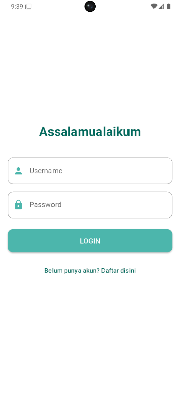
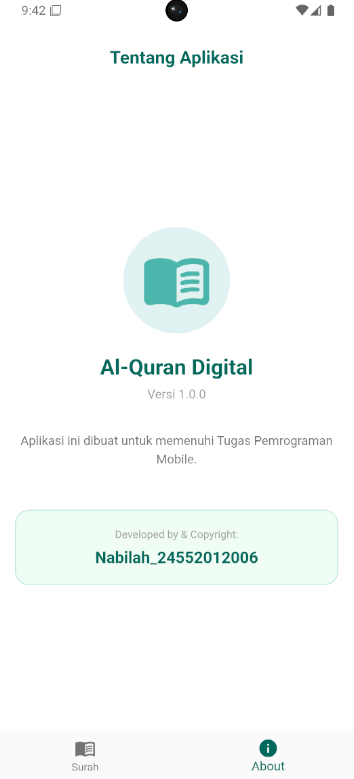

<div align="center">
  

  <h1 align="center">Al-Quran Mobile App</h1>

  <p align="center">
    <strong>Aplikasi Al-Quran Digital Berbasis Flutter</strong><br>
    Diajukan untuk memenuhi Tugas Besar Mata Kuliah Mobile Programming 2
  </p>

  <p align="center">
    <a href="https://flutter.dev/">
      
    </a>
    <a href="https://dart.dev/">
      
    </a>
    <a href="https://m3.material.io/">
      
    </a>
  </p>
</div>

---

## 👨‍🎓 Identitas Penyusun


| Nama | NIM | Kelas |
| :--- | :--- | :--- |
| Nabilah Zulfaa Afifah | 24552012006 | TIF RP 23 CID B |

---

## 📱 Tentang Aplikasi

Aplikasi ini adalah aplikasi Al-Quran digital yang dikembangkan menggunakan **Flutter**. Aplikasi ini bertujuan untuk memudahkan pengguna membaca Al-Quran di mana saja dengan antarmuka yang bersih dan mudah digunakan. Data Al-Quran diambil menggunakan API publik secara *real-time* (atau lokal JSON).

### Fitur Utama:
* ✅ **Daftar Surah:** Menampilkan 114 Surah lengkap dengan arti dan jumlah ayat.
* ✅ **Detail Ayat:** Membaca ayat per ayat dengan terjemahan Bahasa Indonesia.
* ✅ **Audio Murottal:** Pemutar audio untuk mendengarkan lantunan ayat suci.
* ✅ **Pencarian:** Fitur pencarian Surah berdasarkan nama.
* ✅ **Bookmark:** Menandai ayat atau surah terakhir yang dibaca.
* ✅ **Dark Mode:** Dukungan tema gelap untuk kenyamanan membaca di malam hari.

---

## 📸 Tangkapan Layar (Screenshots)

<div align="center">
  
  
  
</div>

---

## 🛠️ Teknologi yang Digunakan

* **Framework:** Flutter (Dart)
* **State Management:** Provider / Bloc / GetX (Pilih salah satu yang kamu pakai)
* **API Service:** HTTP / Dio
* **API Source:** [EQuran.id API](https://equran.id/apidev) (Atau sebutkan API yang kamu pakai)
* **Audio:** Just Audio / Audioplayers

---

## 🚀 Cara Menjalankan Aplikasi

Ikuti langkah-langkah di bawah ini untuk menjalankan proyek ini di lokal komputer Anda:

1.  **Clone Repository**
    ```bash
    git clone [https://github.com/username-kamu/nama-repo-kamu.git](https://github.com/username-kamu/nama-repo-kamu.git)
    ```

2.  **Masuk ke Direktori Project**
    ```bash
    cd nama-repo-kamu
    ```

3.  **Install Dependencies**
    ```bash
    flutter pub get
    ```

4.  **Jalankan Aplikasi**
    ```bash
    flutter run
    ```

---

<div align="center">
  <small>Dibuat dengan ❤️ menggunakan Flutter</small>
</div>
